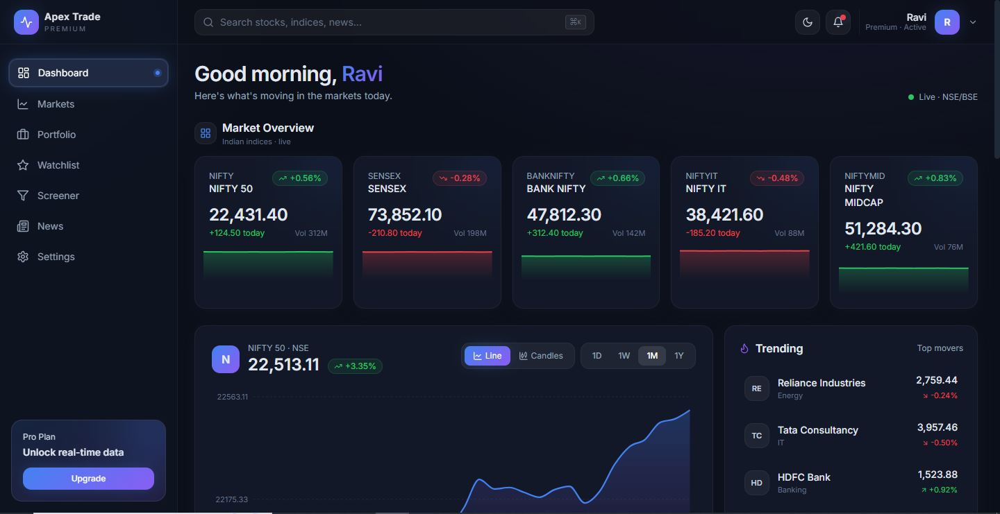
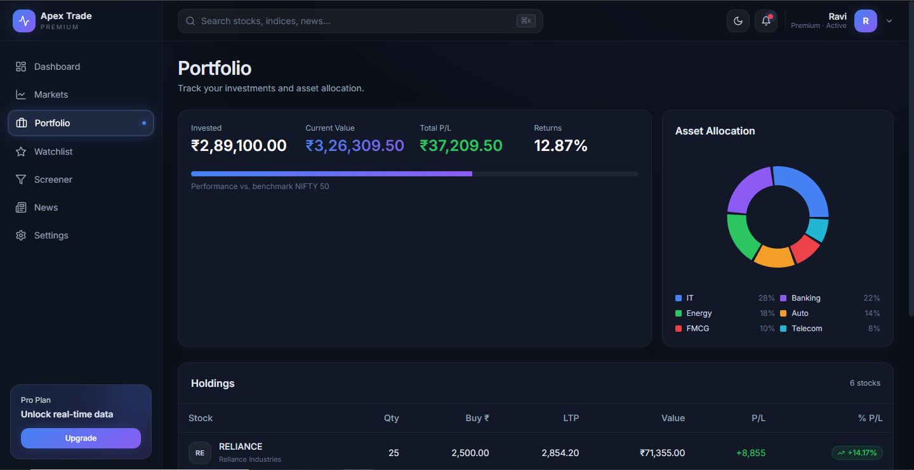
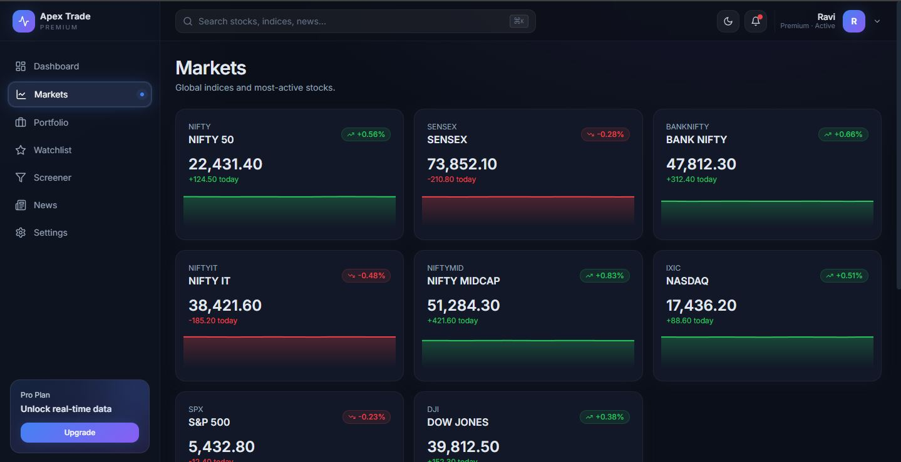
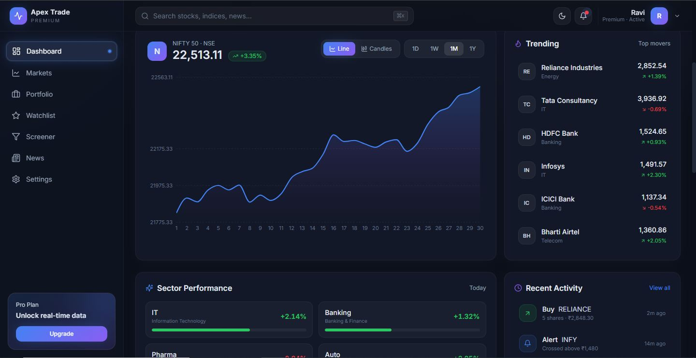

<div align="center">

# 📈 Apex Trade

### A premium, dark-themed Stock Market & Trading Dashboard

*Inspired by TradingView · Built with React, Vite & Tailwind CSS · 100% Frontend*

<p>
  
  
  
  
  
</p>

<p>
  
  
  
  
</p>

[**Live Demo**](#) · [**Report Bug**](#) · [**Request Feature**](#)

---

</div>

## ✨ Overview

**Apex Trade** is a modern, production-grade trading dashboard UI engineered to feel like the real thing — fluid animations, glassmorphic cards, glowing accents, and a deep navy palette inspired by industry-leading platforms. It ships with **mock data**, simulated live ticking prices, and a complete authentication flow — perfect as a portfolio piece, a learning resource, or a starter for your own fintech app.

> 💡 100% frontend. No backend, no API keys. Just clone, install, and run.

---

## 🌟 Highlights

<table>
  <tr>
    <td>🌑 <b>Premium Dark UI</b></td>
    <td>TradingView-inspired theme with glow shadows & glassmorphism</td>
  </tr>
  <tr>
    <td>🌗 <b>Light / Dark Mode</b></td>
    <td>Animated toggle, persists to <code>localStorage</code>, respects system preference</td>
  </tr>
  <tr>
    <td>🔐 <b>Auth Flow (Mock)</b></td>
    <td>Login, Signup, Logout, Protected routes — all client-side</td>
  </tr>
  <tr>
    <td>📊 <b>Live Charts</b></td>
    <td>Area, Line, Bar, Pie & sparklines via Recharts with animated transitions</td>
  </tr>
  <tr>
    <td>🤖 <b>AI Insights Panel</b></td>
    <td>Buy / Sell / Watch signals with confidence bars (UI demo)</td>
  </tr>
  <tr>
    <td>🌍 <b>Global Markets</b></td>
    <td>Snapshot of 8+ world indices alongside Indian (NSE/BSE) markets</td>
  </tr>
  <tr>
    <td>📰 <b>News Feed</b></td>
    <td>Featured story, category chips, search filter, sentiment badges</td>
  </tr>
  <tr>
    <td>📱 <b>Fully Responsive</b></td>
    <td>Mobile drawer sidebar, adaptive grids, breakpoint-tuned typography</td>
  </tr>
  <tr>
    <td>⚡ <b>Buttery Animations</b></td>
    <td>Page transitions, animated nav pill, ticking numbers, hover lifts</td>
  </tr>
</table>

---

## 🖼️ Preview

<div align="center">

<table>
  <tr>
    <td align="center"><br/><sub><b>Dashboard · Market Overview</b></sub></td>
    <td align="center"><br/><sub><b>Sectors · AI Portfolio</b></sub></td>
  </tr>
  <tr>
    <td align="center"><br/><sub><b>Markets / News</b></sub></td>
    <td align="center"><br/><sub><b>Auth · AI Insight</b></sub></td>
  </tr>
</table>

</div>

---

## 🛠️ Tech Stack

| Layer | Technology |
|-------|-----------|
| **Framework** | React 18.3 + Vite 5.4 |
| **Styling** | Tailwind CSS 3.4 (custom palette, dark mode `class`) |
| **Animation** | Framer Motion 11 |
| **Charts** | Recharts 2 |
| **Icons** | Lucide React |
| **Routing** | React Router v6 |
| **State** | Context API + `localStorage` |
| **Lang** | JavaScript (JSX) |

---

## 📂 Project Structure

```
apex-trade/
├── public/
├── src/
│   ├── components/        # Reusable UI (Card, Sidebar, Navbar, Charts, etc.)
│   │   ├── AuthForm.jsx
│   │   ├── ChartContainer.jsx
│   │   ├── Navbar.jsx
│   │   ├── Sidebar.jsx
│   │   ├── NewsCard.jsx
│   │   ├── SectorCard.jsx
│   │   ├── InsightCard.jsx
│   │   └── ...
│   ├── context/           # ThemeContext, AuthContext
│   ├── data/              # mockData.js (indices, news, sectors, etc.)
│   ├── hooks/             # useLivePrices
│   ├── layouts/           # DashboardLayout
│   ├── pages/             # Dashboard, Markets, Portfolio, Watchlist,
│   │                      # Screener, News, Settings, Login, Signup
│   ├── utils/             # format.js, clsx.js
│   ├── App.jsx
│   ├── main.jsx
│   └── index.css
├── tailwind.config.js
├── vite.config.js
└── package.json
```

---

## 🚀 Getting Started

### Prerequisites

- **Node.js** ≥ 18.x
- **npm** / **pnpm** / **yarn**

### Installation

```bash
# 1. Clone the repository
git clone https://github.com/ravi-codingcity/apex-trade.git
cd apex-trade

# 2. Install dependencies
npm install

# 3. Start the dev server
npm run dev
```

Open [http://localhost:5173](http://localhost:5173) in your browser. 🎉

### Available Scripts

| Command | Description |
|---------|-------------|
| `npm run dev` | Start Vite dev server with HMR |
| `npm run build` | Build for production into `dist/` |
| `npm run preview` | Preview the production build locally |
| `npm run lint` | Run ESLint |

---

## 🔐 Authentication (Demo)

The app uses a **mock auth system** — no backend required.

- On first visit you'll be redirected to `/login`
- **Sign up** with any name + valid-looking email + 6-character password
- Session persists in `localStorage` under the key `apex-auth`
- **Logout** from the profile dropdown in the top-right of the navbar
- Protected routes auto-redirect unauthenticated users back to `/login`

> ⚠️ This is a UI demo only. Do **not** use this auth pattern in production.

---

## 🗺️ Pages

| Route | Description |
|-------|-------------|
| `/login` `/signup` | Premium split-screen auth pages with validation |
| `/` | **Dashboard** — Market overview, sectors, AI insights, activity, global markets, gainers/losers |
| `/markets` | Sortable, filterable list of all listed stocks |
| `/portfolio` | Holdings table with P&L, allocation pie chart, performance |
| `/watchlist` | Personal watchlist with add/remove |
| `/screener` | Filter stocks by sector, market cap, change % |
| `/news` | Featured news + category filters + search |
| `/settings` | Profile, preferences, notifications (UI only) |

---

## 🎨 Design System

| Token | Value |
|-------|-------|
| Background | `#0B0F19` |
| Background (soft) | `#0F1422` |
| Card | `#111827` |
| Accent (Blue) | `#3B82F6` |
| Accent (Purple) | `#8B5CF6` |
| Profit (Green) | `#22C55E` |
| Loss (Red) | `#EF4444` |
| Gradient | `linear-gradient(135deg, #3B82F6 → #8B5CF6)` |

Custom Tailwind shadows: `glow`, `glow-purple`, `card`
Custom keyframes: `fade-in`, `shimmer`, `pulseGlow`

---

## 🗺️ Roadmap

- [ ] Real API integration (Alpha Vantage / Finnhub / Yahoo Finance)
- [ ] WebSocket live price streaming
- [ ] Order placement modal (demo trading)
- [ ] User-customizable widgets / drag-and-drop dashboard
- [ ] PWA support with offline shell
- [ ] Internationalization (i18n)
- [ ] Unit + E2E tests (Vitest + Playwright)
- [ ] Dark/Light theme **system** auto-detection toggle in settings

---

## 🤝 Contributing

Contributions are what make the open-source community such an amazing place to learn, inspire, and create. Any contributions you make are **greatly appreciated**.

1. Fork the project
2. Create your feature branch (`git checkout -b feature/AmazingFeature`)
3. Commit your changes (`git commit -m 'Add some AmazingFeature'`)
4. Push to the branch (`git push origin feature/AmazingFeature`)
5. Open a Pull Request

---

## 📜 License

Distributed under the **MIT License**. See [`LICENSE`](LICENSE) for more information.

---

## 🙏 Acknowledgements

- [TradingView](https://www.tradingview.com/) — design inspiration
- [Lucide Icons](https://lucide.dev/)
- [Recharts](https://recharts.org/)
- [Framer Motion](https://www.framer.com/motion/)
- [Tailwind CSS](https://tailwindcss.com/)
- [Shields.io](https://shields.io/) — for the badges

---

<div align="center">

### ⭐ If you like this project, give it a star — it helps a lot!

**Made with ❤️ and ☕ by [Ravi Chaudhary](https://github.com/ravi-codingcity)**

<sub>📈 Happy Trading — *but remember, this is mock data!*</sub>

</div>
